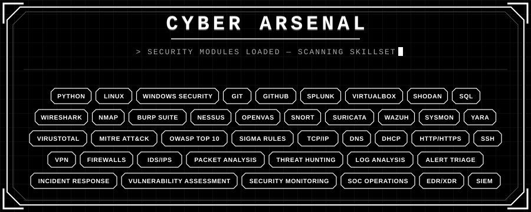

# About me 
  
 

<b>I'm Praveen K</b>. Security caught my attention the way an unusual login attempt catches an analyst's eye: small, easy to miss, impossible to ignore once you notice it. That curiosity became a habit, then a discipline.
 

I studied Computer Science (2022–2026), but most of what shaped me happened outside the syllabus - late nights in a <b>home lab</b>, <b>packet captures</b> that didn't add up, and the quiet satisfaction of turning "something feels off" into "here's exactly what happened, and here's the fix."
 

That curiosity grew into a broader interest in <b>offensive and defensive security</b>: investigating threats, building tools for recon and analysis, and creating defenses grounded in real findings. I also contribute to open-source projects working toward <b>better security for everyone</b>.
 

I lean toward defense because it rewards <b>patience</b>, <b>pattern recognition</b>, and <b>evidence over assumptions</b>. Right now, I'm looking to bring that mindset into a <b>Cybersecurity Analyst / L1 Network Engineer</b> role - where I can monitor, investigate, and respond to real threats.
 

 

  
 # Cyber Arsenal 
  

 

 
  

     
  
# Team Collaboration  

 

Security isn't a solo sport. The real breakthroughs happen when analysts **talk to each other** - when someone says, *"I saw something similar yesterday,"* and suddenly a **pattern clicks** into place.

I've built my workflow around the full incident lifecycle 
**Alert Detection → Triage → Investigation → Escalation → Documentation**

I chase the **story behind every alert**. Each log entry is a clue, each false positive is a lesson, and each handoff is a chance to leave the next analyst with **context, not confusion**.

I believe great security teams are built on **trust, clear communication, and shared knowledge**, the kind of team I want to be part of, and the kind of analyst I'm continuously working to become.
 

Documentation, playbooks, and post-incident write-ups aren't paperwork bolted onto the job. They're part of the **actual defense**. Looping back on closed incidents to see what the alert logic missed, and sharing that with the team, is what turns individual catches into **"knowledge that lifts the whole team**.

 

  
# 
 

   

# 
 

