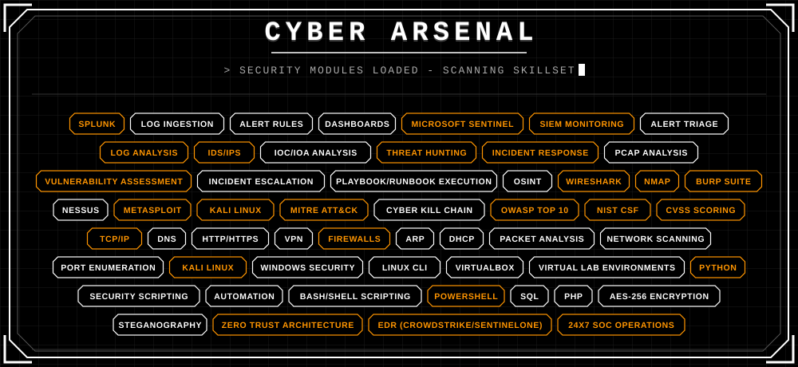

# 𝙰𝚋𝚘𝚞𝚝 𝚖𝚎
  
 

<b>𝙸'𝚖 𝙿𝚛𝚊𝚟𝚎𝚎𝚗 𝙺</b>. 𝚂𝚎𝚌𝚞𝚛𝚒𝚝𝚢 𝚌𝚊𝚞𝚐𝚑𝚝 𝚖𝚢 𝚊𝚝𝚝𝚎𝚗𝚝𝚒𝚘𝚗 𝚝𝚑𝚎 𝚠𝚊𝚢 𝚊𝚗 𝚞𝚗𝚞𝚜𝚞𝚊𝚕 𝚕𝚘𝚐𝚒𝚗 𝚊𝚝𝚝𝚎𝚖𝚙𝚝 𝚌𝚊𝚝𝚌𝚑𝚎𝚜 𝚊𝚗 𝚊𝚗𝚊𝚕𝚢𝚜𝚝'𝚜 𝚎𝚢𝚎: 𝚜𝚖𝚊𝚕𝚕, 𝚎𝚊𝚜𝚢 𝚝𝚘 𝚖𝚒𝚜𝚜, 𝚒𝚖𝚙𝚘𝚜𝚜𝚒𝚋𝚕𝚎 𝚝𝚘 𝚒𝚐𝚗𝚘𝚛𝚎 𝚘𝚗𝚌𝚎 𝚢𝚘𝚞 𝚗𝚘𝚝𝚒𝚌𝚎 𝚒𝚝. 𝚃𝚑𝚊𝚝 𝚌𝚞𝚛𝚒𝚘𝚜𝚒𝚝𝚢 𝚋𝚎𝚌𝚊𝚖𝚎 𝚊 𝚑𝚊𝚋𝚒𝚝, 𝚝𝚑𝚎𝚗 𝚊 𝚍𝚒𝚜𝚌𝚒𝚙𝚕𝚒𝚗𝚎.
 

𝙸 𝚜𝚝𝚞𝚍𝚒𝚎𝚍 𝙲𝚘𝚖𝚙𝚞𝚝𝚎𝚛 𝚂𝚌𝚒𝚎𝚗𝚌𝚎 (𝟸𝟶𝟸𝟸–𝟸𝟶𝟸𝟼), 𝚋𝚞𝚝 𝚖𝚘𝚜𝚝 𝚘𝚏 𝚠𝚑𝚊𝚝 𝚜𝚑𝚊𝚙𝚎𝚍 𝚖𝚎 𝚑𝚊𝚙𝚙𝚎𝚗𝚎𝚍 𝚘𝚞𝚝𝚜𝚒𝚍𝚎 𝚝𝚑𝚎 𝚜𝚢𝚕𝚕𝚊𝚋𝚞𝚜 - 𝚕𝚊𝚝𝚎 𝚗𝚒𝚐𝚑𝚝𝚜 𝚒𝚗 𝚊 <b>𝚑𝚘𝚖𝚎 𝚕𝚊𝚋</b>, <b>𝚙𝚊𝚌𝚔𝚎𝚝 𝚌𝚊𝚙𝚝𝚞𝚛𝚎𝚜</b> 𝚝𝚑𝚊𝚝 𝚍𝚒𝚍𝚗'𝚝 𝚊𝚍𝚍 𝚞𝚙, 𝚊𝚗𝚍 𝚝𝚑𝚎 𝚚𝚞𝚒𝚎𝚝 𝚜𝚊𝚝𝚒𝚜𝚏𝚊𝚌𝚝𝚒𝚘𝚗 𝚘𝚏 𝚝𝚞𝚛𝚗𝚒𝚗𝚐 "𝚜𝚘𝚖𝚎𝚝𝚑𝚒𝚗𝚐 𝚏𝚎𝚎𝚕𝚜 𝚘𝚏𝚏" 𝚒𝚗𝚝𝚘 "𝚑𝚎𝚛𝚎'𝚜 𝚎𝚡𝚊𝚌𝚝𝚕𝚢 𝚠𝚑𝚊𝚝 𝚑𝚊𝚙𝚙𝚎𝚗𝚎𝚍, 𝚊𝚗𝚍 𝚑𝚎𝚛𝚎'𝚜 𝚝𝚑𝚎 𝚏𝚒𝚡."
 

𝚃𝚑𝚊𝚝 𝚌𝚞𝚛𝚒𝚘𝚜𝚒𝚝𝚢 𝚐𝚛𝚎𝚠 𝚒𝚗𝚝𝚘 𝚊 𝚋𝚛𝚘𝚊𝚍𝚎𝚛 𝚒𝚗𝚝𝚎𝚛𝚎𝚜𝚝 𝚒𝚗 <b>𝚘𝚏𝚏𝚎𝚗𝚜𝚒𝚟𝚎 𝚊𝚗𝚍 𝚍𝚎𝚏𝚎𝚗𝚜𝚒𝚟𝚎 𝚜𝚎𝚌𝚞𝚛𝚒𝚝𝚢</b>: 𝚒𝚗𝚟𝚎𝚜𝚝𝚒𝚐𝚊𝚝𝚒𝚗𝚐 𝚝𝚑𝚛𝚎𝚊𝚝𝚜, 𝚋𝚞𝚒𝚕𝚍𝚒𝚗𝚐 𝚝𝚘𝚘𝚕𝚜 𝚏𝚘𝚛 𝚛𝚎𝚌𝚘𝚗 𝚊𝚗𝚍 𝚊𝚗𝚊𝚕𝚢𝚜𝚒𝚜, 𝚊𝚗𝚍 𝚌𝚛𝚎𝚊𝚝𝚒𝚗𝚐 𝚍𝚎𝚏𝚎𝚗𝚜𝚎𝚜 𝚐𝚛𝚘𝚞𝚗𝚍𝚎𝚍 𝚒𝚗 𝚛𝚎𝚊𝚕 𝚏𝚒𝚗𝚍𝚒𝚗𝚐𝚜. 𝙸 𝚊𝚕𝚜𝚘 𝚌𝚘𝚗𝚝𝚛𝚒𝚋𝚞𝚝𝚎 𝚝𝚘 𝚘𝚙𝚎𝚗-𝚜𝚘𝚞𝚛𝚌𝚎 𝚙𝚛𝚘𝚓𝚎𝚌𝚝𝚜 𝚠𝚘𝚛𝚔𝚒𝚗𝚐 𝚝𝚘𝚠𝚊𝚛𝚍 <b>𝚋𝚎𝚝𝚝𝚎𝚛 𝚜𝚎𝚌𝚞𝚛𝚒𝚝𝚢 𝚏𝚘𝚛 𝚎𝚟𝚎𝚛𝚢𝚘𝚗𝚎</b>.
 

𝙸 𝚕𝚎𝚊𝚗 𝚝𝚘𝚠𝚊𝚛𝚍 𝚍𝚎𝚏𝚎𝚗𝚜𝚎 𝚋𝚎𝚌𝚊𝚞𝚜𝚎 𝚒𝚝 𝚛𝚎𝚠𝚊𝚛𝚍𝚜 <b>𝚙𝚊𝚝𝚒𝚎𝚗𝚌𝚎</b>, <b>𝚙𝚊𝚝𝚝𝚎𝚛𝚗 𝚛𝚎𝚌𝚘𝚐𝚗𝚒𝚝𝚒𝚘𝚗</b>, 𝚊𝚗𝚍 <b>𝚎𝚟𝚒𝚍𝚎𝚗𝚌𝚎 𝚘𝚟𝚎𝚛 𝚊𝚜𝚜𝚞𝚖𝚙𝚝𝚒𝚘𝚗𝚜</b>. 𝚁𝚒𝚐𝚑𝚝 𝚗𝚘𝚠, 𝙸'𝚖 𝚕𝚘𝚘𝚔𝚒𝚗𝚐 𝚝𝚘 𝚋𝚛𝚒𝚗𝚐 𝚝𝚑𝚊𝚝 𝚖𝚒𝚗𝚍𝚜𝚎𝚝 𝚒𝚗𝚝𝚘 𝚊 <b>𝙲𝚢𝚋𝚎𝚛𝚜𝚎𝚌𝚞𝚛𝚒𝚝𝚢 𝙰𝚗𝚊𝚕𝚢𝚜𝚝 / 𝙻𝟷 𝙽𝚎𝚝𝚠𝚘𝚛𝚔 𝙴𝚗𝚐𝚒𝚗𝚎𝚎𝚛</b> 𝚛𝚘𝚕𝚎 - 𝚠𝚑𝚎𝚛𝚎 𝙸 𝚌𝚊𝚗 𝚖𝚘𝚗𝚒𝚝𝚘𝚛, 𝚒𝚗𝚟𝚎𝚜𝚝𝚒𝚐𝚊𝚝𝚎, 𝚊𝚗𝚍 𝚛𝚎𝚜𝚙𝚘𝚗𝚍 𝚝𝚘 𝚛𝚎𝚊𝚕 𝚝𝚑𝚛𝚎𝚊𝚝𝚜.
 

 # 
 

    

 

 
  

     
  
# 𝚃𝚎𝚊𝚖 𝙲𝚘𝚕𝚕𝚊𝚋𝚘𝚛𝚊𝚝𝚒𝚘𝚗  

 

𝚂𝚎𝚌𝚞𝚛𝚒𝚝𝚢 𝚒𝚜𝚗'𝚝 𝚊 𝚜𝚘𝚕𝚘 𝚜𝚙𝚘𝚛𝚝. 𝚃𝚑𝚎 𝚛𝚎𝚊𝚕 𝚋𝚛𝚎𝚊𝚔𝚝𝚑𝚛𝚘𝚞𝚐𝚑𝚜 𝚑𝚊𝚙𝚙𝚎𝚗 𝚠𝚑𝚎𝚗 𝚊𝚗𝚊𝚕𝚢𝚜𝚝𝚜 **𝚝𝚊𝚕𝚔 𝚝𝚘 𝚎𝚊𝚌𝚑 𝚘𝚝𝚑𝚎𝚛** - 𝚠𝚑𝚎𝚗 𝚜𝚘𝚖𝚎𝚘𝚗𝚎 𝚜𝚊𝚢𝚜, *"𝙸 𝚜𝚊𝚠 𝚜𝚘𝚖𝚎𝚝𝚑𝚒𝚗𝚐 𝚜𝚒𝚖𝚒𝚕𝚊𝚛 𝚢𝚎𝚜𝚝𝚎𝚛𝚍𝚊𝚢,"* 𝚊𝚗𝚍 𝚜𝚞𝚍𝚍𝚎𝚗𝚕𝚢 𝚊 **𝚙𝚊𝚝𝚝𝚎𝚛𝚗 𝚌𝚕𝚒𝚌𝚔𝚜** 𝚒𝚗𝚝𝚘 𝚙𝚕𝚊𝚌𝚎.

𝙸'𝚟𝚎 𝚋𝚞𝚒𝚕𝚝 𝚖𝚢 𝚠𝚘𝚛𝚔𝚏𝚕𝚘𝚠 𝚊𝚛𝚘𝚞𝚗𝚍 𝚝𝚑𝚎 𝚏𝚞𝚕𝚕 𝚒𝚗𝚌𝚒𝚍𝚎𝚗𝚝 𝚕𝚒𝚏𝚎𝚌𝚢𝚌𝚕𝚎 
**𝙰𝚕𝚎𝚛𝚝 𝙳𝚎𝚝𝚎𝚌𝚝𝚒𝚘𝚗 → 𝚃𝚛𝚒𝚊𝚐𝚎 → 𝙸𝚗𝚟𝚎𝚜𝚝𝚒𝚐𝚊𝚝𝚒𝚘𝚗 → 𝙴𝚜𝚌𝚊𝚕𝚊𝚝𝚒𝚘𝚗 → 𝙳𝚘𝚌𝚞𝚖𝚎𝚗𝚝𝚊𝚝𝚒𝚘𝚗**

𝙸 𝚌𝚑𝚊𝚜𝚎 𝚝𝚑𝚎 **𝚜𝚝𝚘𝚛𝚢 𝚋𝚎𝚑𝚒𝚗𝚍 𝚎𝚟𝚎𝚛𝚢 𝚊𝚕𝚎𝚛𝚝**. 𝙴𝚊𝚌𝚑 𝚕𝚘𝚐 𝚎𝚗𝚝𝚛𝚢 𝚒𝚜 𝚊 𝚌𝚕𝚞𝚎, 𝚎𝚊𝚌𝚑 𝚏𝚊𝚕𝚜𝚎 𝚙𝚘𝚜𝚒𝚝𝚒𝚟𝚎 𝚒𝚜 𝚊 𝚕𝚎𝚜𝚜𝚘𝚗, 𝚊𝚗𝚍 𝚎𝚊𝚌𝚑 𝚑𝚊𝚗𝚍𝚘𝚏𝚏 𝚒𝚜 𝚊 𝚌𝚑𝚊𝚗𝚌𝚎 𝚝𝚘 𝚕𝚎𝚊𝚟𝚎 𝚝𝚑𝚎 𝚗𝚎𝚡𝚝 𝚊𝚗𝚊𝚕𝚢𝚜𝚝 𝚠𝚒𝚝𝚑 **𝚌𝚘𝚗𝚝𝚎𝚡𝚝, 𝚗𝚘𝚝 𝚌𝚘𝚗𝚏𝚞𝚜𝚒𝚘𝚗**.

𝙸 𝚋𝚎𝚕𝚒𝚎𝚟𝚎 𝚐𝚛𝚎𝚊𝚝 𝚜𝚎𝚌𝚞𝚛𝚒𝚝𝚢 𝚝𝚎𝚊𝚖𝚜 𝚊𝚛𝚎 𝚋𝚞𝚒𝚕𝚝 𝚘𝚗 **𝚝𝚛𝚞𝚜𝚝, 𝚌𝚕𝚎𝚊𝚛 𝚌𝚘𝚖𝚖𝚞𝚗𝚒𝚌𝚊𝚝𝚒𝚘𝚗, 𝚊𝚗𝚍 𝚜𝚑𝚊𝚛𝚎𝚍 𝚔𝚗𝚘𝚠𝚕𝚎𝚍𝚐𝚎**, 𝚝𝚑𝚎 𝚔𝚒𝚗𝚍 𝚘𝚏 𝚝𝚎𝚊𝚖 𝙸 𝚠𝚊𝚗𝚝 𝚝𝚘 𝚋𝚎 𝚙𝚊𝚛𝚝 𝚘𝚏, 𝚊𝚗𝚍 𝚝𝚑𝚎 𝚔𝚒𝚗𝚍 𝚘𝚏 𝚊𝚗𝚊𝚕𝚢𝚜𝚝 𝙸'𝚖 𝚌𝚘𝚗𝚝𝚒𝚗𝚞𝚘𝚞𝚜𝚕𝚢 𝚠𝚘𝚛𝚔𝚒𝚗𝚐 𝚝𝚘 𝚋𝚎𝚌𝚘𝚖𝚎.
 

𝙳𝚘𝚌𝚞𝚖𝚎𝚗𝚝𝚊𝚝𝚒𝚘𝚗, 𝚙𝚕𝚊𝚢𝚋𝚘𝚘𝚔𝚜, 𝚊𝚗𝚍 𝚙𝚘𝚜𝚝-𝚒𝚗𝚌𝚒𝚍𝚎𝚗𝚝 𝚠𝚛𝚒𝚝𝚎-𝚞𝚙𝚜 𝚊𝚛𝚎𝚗'𝚝 𝚙𝚊𝚙𝚎𝚛𝚠𝚘𝚛𝚔 𝚋𝚘𝚕𝚝𝚎𝚍 𝚘𝚗𝚝𝚘 𝚝𝚑𝚎 𝚓𝚘𝚋. 𝚃𝚑𝚎𝚢'𝚛𝚎 𝚙𝚊𝚛𝚝 𝚘𝚏 𝚝𝚑𝚎 **𝚊𝚌𝚝𝚞𝚊𝚕 𝚍𝚎𝚏𝚎𝚗𝚜𝚎**. 𝙻𝚘𝚘𝚙𝚒𝚗𝚐 𝚋𝚊𝚌𝚔 𝚘𝚗 𝚌𝚕𝚘𝚜𝚎𝚍 𝚒𝚗𝚌𝚒𝚍𝚎𝚗𝚝𝚜 𝚝𝚘 𝚜𝚎𝚎 𝚠𝚑𝚊𝚝 𝚝𝚑𝚎 𝚊𝚕𝚎𝚛𝚝 𝚕𝚘𝚐𝚒𝚌 𝚖𝚒𝚜𝚜𝚎𝚍, 𝚊𝚗𝚍 𝚜𝚑𝚊𝚛𝚒𝚗𝚐 𝚝𝚑𝚊𝚝 𝚠𝚒𝚝𝚑 𝚝𝚑𝚎 𝚝𝚎𝚊𝚖, 𝚒𝚜 𝚠𝚑𝚊𝚝 𝚝𝚞𝚛𝚗𝚜 𝚒𝚗𝚍𝚒𝚟𝚒𝚍𝚞𝚊𝚕 𝚌𝚊𝚝𝚌𝚑𝚎𝚜 𝚒𝚗𝚝𝚘 **"𝚔𝚗𝚘𝚠𝚕𝚎𝚍𝚐𝚎 𝚝𝚑𝚊𝚝 𝚕𝚒𝚏𝚝𝚜 𝚝𝚑𝚎 𝚠𝚑𝚘𝚕𝚎 𝚝𝚎𝚊𝚖**.

 

  
# 
 

   

# 
 

